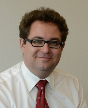
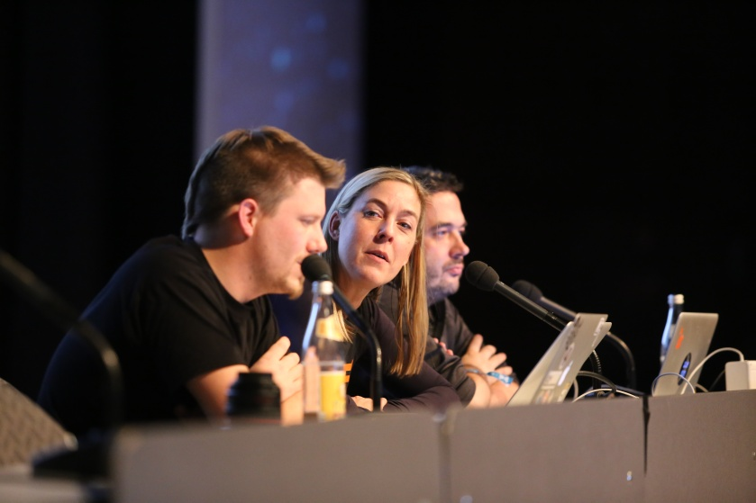

<!-- Generated by tools/pdf2md/convert.mjs. Do not edit by hand. -->
<!-- Source: temp/PMPC-Modernising-with-Free-Software.pdf; SHA-256: f0a2ee4399a3f3e1d04dcae637bd9f9a4a10893c14096baf20882d29c95b3e43; pdftotext version 25.03.0 -->

<!-- Source PDF page 1 -->
Free Software Foundation Europe

Modernising Public Infrastructure with Free Software

<!-- Source PDF page 2 -->
Published by the Free Software Foundation Europe (FSFE) Berlin, January 2019 EU transparency register ID: 33882407107‐76 www.fsfe.org

Responsible according to European press law: Matthias Kirschner / FSFE e.V. Schönhauser Allee 6/7 10119 Berlin Germany

Edited by: Carol McGuigan, Jennifer Neal

Designed by: Markus Meier

Licence information: https://creativecommons.org/licenses/by/2.0 https://creativecommons.org/licenses/by/4.0 https://creativecommons.org/licenses/by-sa/4.0

Contributions by: Erik Albers, Alexandra Busch, Matthias Kirschner, Max Mehl, Katharina Nocun, George Brooke‐Smith

The articles with contributions by Francesca Bria (p.6) and Constanze Kurz (p.21) are extracts from longer interviews. You can read the full interviews at fsfe.org.

Contents of this report may be quoted or reproduced, provided that the source of information is acknowledged. All contents are, as long as not noted otherwise, licensed as CC BY‐SA 4.0.

Photo credits: p.1, 11, 23: Campaign Video Public Money Public Code. CC BY 4 fsfe.org & motionensemble.de. p.7: AI for Good Global Summit 2018 CC BY 2 ITU Pictures. p.15: Portrait Cedric Thomas. All Rights Reserved. p.15: Dusk on “La Défense” – Paris. CC BY 2 Gael Varoquaux. p.21: End of the year review for the Chaos Computer Club at the 30th Chaos Communication Congress in Hamburg, 2013 CC BY‐SA 4 Wikipedia / Tobias Klenze.

Acknowledgements: We would like to thank the members of the FSFE campaign team for discussions and insightful comments on drafts of the texts. We thank Cedric Thomas, Prof. Dr. Simon Schlauri, Dr. Matthias Stürmer, Basanta Thapa, Fernanda G. Weiden and Lori Roussey for their wonderful contributions. We are grateful to Alexander Lehmann and Lena Schall for producing the Public Money Public Code campaign video and providing graphic elements for this publication. We thank Ura Design for their support in visualising the most important facts about Free Software. We thank our donors, supporters and especially the Digital Rights Fund for financial support of the publication.

<!-- Source PDF page 3 -->

Matthias Kirschner President of the Free Software Foundation Europe

Dear reader,

Today, digital technologies are a crucial part of the infrastructure of modern states. This challenges public administrations, raises new questions regarding control, security, efficiency, distribution of power, and transparency of institutions.

The Free Software Foundation Europe (FSFE) has been working as a charity since 2001 on empowering users to control technology, because we believe we need technology which empowers users instead of restricting their freedom. Free Software gives everybody – individuals, companies, organisations, and public administration – the rights to use, study, share, and improve software. For public administration, Free Software means more sustainability due to the re‐use of existing software code and the benefits of sharing code and costs with other institutions. For companies, civil society, and citizens, innovative licensing policies mean more choice, transparency, competition, and cost efficiency.

Free Software in public administration is not a short‐term trend. The last few years have seen significant changes in the attitudes of public administrations towards IT procurement, increasingly favouring a strategic, long‐term‐oriented approach. More and more state actors are concerned about the long‐term costs and dangers incurred by a dependency on single software vendors. Successful counter‐strategies against vendor lock‐in, proven to work in practice, rely to a great degree on open standards and Free Software licences. New procurement policies help to minimise dependencies and to lower costs via competitive Free Software offers. A growing number of countries have implemented roadmaps or legislation that support the use of Free Software licences in the public sector. Today, even large scale government IT projects are published regularly under Free Software licences.

The publication of this brochure is a response to a growing number of requests from the public sector sent to us at the FSFE. This collection of articles, interviews, and basic information provides answers to the most common questions regarding the implementation of Free Software in the public sector. The following pages contain relevant use‐cases, background information, and expert advice for the modernisation of public infrastructure. As a scientist, trained in public administration, I hope this report will contribute to the modernisation of the IT infrastructure in public administration, and thereby provide a better service for citizens.

Sincerely,

Matthias Kirschner

<!-- Source PDF page 4 -->
What is Free Software?

The principles of Free Software are simple but its licensing and synonyms add complexity. We explain the basics.

The term Free Software was created in 1986 by Richard M. Stallman. Free Software refers to freedom, not price. It guarantees its users the essential four freedoms. The absence of at least one of these freedoms means an application is proprietary, so non‐Free Software.

The Four Freedoms

Free Software can be used for any purpose and is free of restrictions such as licence expiry or geographic limitations.

Free Software can be shared and copied at virtually no cost.

Licences

Synonyms

Free Software

The original term, created in 1986

1 More information on different terms and licence categories: https://fsfe.org/freesoftware/basics/comparison 2 https://www.gnu.org/licenses/license-list.html 3 https://opensource.org/licenses/category

Free Software and its code can be studied by anyone, without non‐disclosure agreements or similar restrictions.

Use

Study

Share

Improve

Free Software can be modified by anyone, and these improvements can be shared publicly.

The four freedoms are given by a software’s licence. The Free Software Foundation 1 and the Open Source Initiative 2 maintain lists of reviewed and approved licences. An application can usually not be considered Free Software, if its licence does not appear in these lists.

There are a multitude of licences with different focal points. The actual selection is a strategic question but you are advised to pick one of the most widely used licences.

Over the course of time, people came up with additional labels for Free Software. 3 Often the motivation for these terms is to highlight different aspects and to avoid confusion.

Set up as a marketing campaign for Free Software in 1998

Open Source

Initiated to avoid the ambiguity of the English word free, borrowed from French and Spanish

Libre Software

Abbreviations for Free (Libre) and Open Source Software

FOSS / FLOSS

The level of freedom a particular software offers is always determined by the licence, not the label. In other words, don’t get confused by different terms for the same features.

<!-- Source PDF page 6 -->
Using Free Software to Democratise Smart Cities

Free Software has become a core element of Barcelona’s smart city and digitalisation agenda. In this interview, Francesca Bria, Chief Technology and Digital Innovation Officer (CTIO) for the Barcelona City Council, explains how Free Software is supporting innovation.

In your work, you often refer to digital sovereignty and ethical digital standards. Could you briefly explain what digital sovereignty is, and what role Free Software has in relation to it?

I have been appointed as CTIO of Barcelona to rethink the digital and technology agenda of the city, in particular the smart city agenda. My mission is to democratise data and technology, and to rethink their governance in a way that serves the people.

Does it make a difference if a platform like Decidim is Free Software or not?

Decidim is a participatory democracy framework software that allows citizens to debate, attend meetings and create proposals with the goal of improving life in the city. The platform’s source code is publicly available, enabling other cities to use and adapt it to their own requirements. It is based on a similar Free Software project by the Madrid City Council, called Consul.

Free Software makes all the difference. First of all, government is investing public money and that’s why citizens should control the software and the platform should remain in the public domain. As one of the city’s biggest Free Software projects, we are learning a lot from Decidim Barcelona. We even had to change procurement standards to make sure that government legislation allows a platform that is managed and governed by a community.

For us, privacy awareness, data sovereignty, distributed technology, and Free Software are key components of a city’s digital infrastructure. Due to another Free Software project, called DECODE, we are adding a module to Decidim, which gives citizens control over their data. We ensure that the data is secure and anonymous, and that people can decide what data they want to keep private, and what data they want to donate to the city and on what terms.

What is the key advantage of Free Software in this respect?

The greatest possibility lies in the ability to see and inspect the code, learn from it, and reuse it. This is very important, because you can minimise the costs and concentrate on investing in human resources and capabilities instead of licensing.

Another key reason is technological sovereignty, which means getting away from vendor lock‐in and dependency on big corporate players, being able to change providers, work with local entrepreneurs who respect users’ rights and freedoms, and retain control of our data. With proprietary software, everything was outsourced to external providers and experts, who work with specific technologies. We don’t want to keep losing this kind of inside knowledge.

“… there is a lot of collaboration going on, without Free Software this would not be possible.”

Free Software allows us to work with communities, use the talent of Free Software developers and collaborate with other cities on joint projects. In the long run, you can be more autonomous, you can be more independent, and you can be more transparent. Moreover,

<!-- Source PDF page 7 -->

Francesca Bria Bria holds a PhD in Innovation Economics from Imperial College, London and an MSc on Digital Economy from Birbeck, University of London. She is a senior researcher and advisor for the European Commission on Future Internet and innovation policy.

publishing source code is a way to give taxpayers’ money back to society.

Last but not least, it is an ethical and political decision. Barcelona has a specific data sovereignty guide and digital ethics standards – regulations, which state that the digital information and infrastructure we use should be a public good, owned by citizens.

In five years, how do you think the situation will look?

Barcelona is constantly developing software applications and tools. When we start from scratch, we give preference to the use of Free and Open Source Software. Also, Barcelona’s Digital Transformation Plan has committed to investing 70% of its annual budget into Free and Open Source Software development.

“Now we have 3,000 companies that work with us … over 60% are small and medium-sized companies.”

We are gradually running a migration plan with a pilot project on migrating workstations to a completely free operating system, but this is not just about workstations, the whole informational infrastructure is moving towards open standards, open stack, and interoperability. Also, it is important for such decisions to not depend on one person or on the political orientation of one government. I think the right way to do such a major transition is to create empowerment for the workers, invest in training, and build knowledge‐sharing processes inside the organisations.

Sentilo is run by a consortium, and it has been reused in Dubai, in the US, in Italy, and in other parts of Europe. Decidim is used by many cities nowadays and we have ambitions to extend it. We also have other software projects like the digital ID, which we share locally with smaller town halls in Catalonia.

We are also doing interviews and research, to see which projects other cities have developed and published as Free Software. For instance, Helsinki has developed a very good app for transport sharing and they also have another citizen app like ours. We are cooperating with Amsterdam and Torino, so there is a lot of collaboration going on. Without Free Software this would not be possible.

Sentilo is a sensor and actuator platform aimed at municipalities or organisations that process large amounts of information received from the terrain. It processes information generated by various devices, like sensors for noise and air contamination or traffic congestion. It is used and supported by an active and diverse community of cities and companies.

You mentioned you invest 70% of the new development budget into Free Software development. What effect does this have on the local economy?

It creates local Free Software and opens a tech ecosystem that can strengthen the collaborative innovation economy. Public procurement can create new markets and leverage local industry.

<!-- Source PDF page 8 -->
Now, we have 3,000 companies that work with us through public procurement and over 60% would you convince them? What would be the main argument?

are small and medium‐sized companies. These contracts benefit from having no lock‐in or technical preconditions, so whoever has the capacity can win these contracts. This is a big change for a city administration. We want to empower the local Free and Open Source movement and provide a platform to sustain and develop.

First, the money that you invest goes into your local ecosystem of companies, the local industry and local entrepreneurs; second, the ability to collaborate with other cities on joint projects and help smaller cities benefit from these projects; third, retaining technological sovereignty of critical infrastructure and services. This is very important to build a more democratic, inclusive, and sustainable digital society. By Erik Albers. Edited by Alexandra Busch.

There are already other cities that see the advantages of Free Software, but also some administrations that still have concerns. How

The Costs of Vendor Lock-In

Convincing features, good service, and trust in the current provider are positive reasons why institutions may be reluctant to make changes in their digital infrastructure. The most important and often underestimated negative cause for extending contracts with a provider is vendor lock‐in.

Vendor lock‐in makes customers dependent on a single supplier. It creates artificial obstacles by significantly increasing the costs and efforts involved in switching to another vendor. Vendor lock‐in can be caused by legal hurdles like contract clauses, dispensable dependencies on other software, proprietary licences, as well as closed or obscure standards causing incompatibilities. 1

In public administrations, there are many manifestations of vendor lock‐in. For instance, file formats of documents only being readable by a specific product, database content not convertible to a competing vendor’s format, or the constraint to buy an overpriced software upgrade in order to be able to access files and receive security fixes. Over the years, many institutions have spent large amounts of money on outdated systems just to avoid switching costs caused by vendor lock‐in.

With the outsourcing of services and storage to cloud providers becoming more and more prominent, the problem of lock‐in is growing. Control over and knowledge of the actual technology is decreasing 2 while costs can easily explode due to reduced overview. The deeper a department is integrated into such an environment, the harder migration to solutions offered by other vendors can become.

Obviously, customers usually don’t actively choose to become locked‐in by a certain vendor, and they are often even unaware of this threat. But there are ways to prevent getting into this situation:

> Screen the market before acquiring a product and take both entry and exit costs into account. > Ensure that data can be migrated to alternative providers without unforeseeable costs. > Use products supporting Open Standards 3 which are vendor independent and interoperable with alternative software. > Use Free Software which allows the contracting of third parties to enhance and fix a software.

Free Software products using Open Standards help prevent costly migrations by allowing incremental improvements and vendor‐independent support. They provide flexibility in a rapidly changing digital world.

1 Mackintosh S. 2018, An Open Digital Approach for the NHS 2 McKendrick J. 2011, Cloud Computing’s Vendor Lock‐In Problem: Why the Industry is Taking a Step Backward. https://www.forbes.com/sites/joemckendrick/2011/11/20/cloud-computingsvendor-lock-in-problem-why-the-industry-is-taking-a-step-backwards 3 https://fsfe.org/activities/os

<!-- Source PDF page 9 -->
Hidden Champions

When thinking about the public good, most people think about streets, schools or hospitals. Increasingly, more and more public administrations now also think of software and, to be precise, Free Software.

The list of publicly funded software projects making their source code publicly available and sharing it with other institutions grows longer day by day. For instance, the German Union Library Network (GBV) provides a Free Software solution that is used by libraries throughout Germany. 1 The state of Luxembourg offers an electronic health record system used by many practitioners and clinics. 2 The Dutch Ministry of the Interior publishes large parts of its central civil register database’s (BRP) source code. 3 The Czech Ministry of Finance provides an online visualisation for institutions’ budget plans. 4 Some Free Software solutions have even been utilised internationally. The National Land Survey of

Hundreds of state actors have an account on GitHub

Finland has developed Oskari, a software for visualising and analysing spatial and statistical data. Oskari includes features that channel citizen feedback regarding new infrastructure projects, provide real estate information services, and display fishing areas. 5 This has convinced the Icelandic National Geoportal and the National Land Survey of Moldova to use Oskari as well.

Institutions that do not consider publishing their software code are letting important opportunities pass. If potentially re‐usable code is hidden from other state actors, this may result in redundant software projects and thereby higher costs for the institutions and the taxpayer. Backed by positive experience, public administrations realise that sharing the source code of their projects is in their own best interest. Hundreds of state actors have an account on GitHub 6 , a private platform for code sharing, and some countries even host their own public code repositories.

The change currently taking place in the public sector is not merely about quantity. It is also an initiative aimed at better governance and more transparency regarding government services. Code transparency has been proven to build trust in digital government infrastructure, especially in sensitive areas. Free Software policies allow for security checks by independent parties. An application for encrypted instant messages provided by the National Cybersecurity Agency of France for secure communication between institutions is based on two Free Software projects: Matrix and Riot. The Free Software project OSiP (OSiP stands for Online‐ Sicherheitsüberprüfung or online security check) is used to

The Open Government Toolbox collects more than 1401 tools (mainly Free Software) from more than 590 organisations. From data visualisation to partici pation tools, to appli cations for local urban initiatives – the spectrum of this stunning collection shows the potential for Free Software in combination with open data. https://ogptoolbox.org support security checks at German airports. 7 The code of Pro‐ Zorro, the award winning Ukrainian software for transparent procurement processes, can be checked online. 8 Transparency International Ukraine supported this decision. 9 Even more important than the economic benefits of Free Software is earning the most valuable currency in a democracy: the trust of its citizens in state infrastructure. The more infrastructure of modern states becomes dependent upon IT, the more critical this argument will become.

1 https://github.com/gbv 2 https://joinup.ec.europa.eu/community/osor/news/ luxembourg-open-source-health-records-system-gainsfoothold 3 https://github.com/MinBZK 4 https://github.com/otevrena-data-mfcr 5 http://www.oskari.org 6 https://government.github.com/community 7 https://www.wirtschaft.nrw/onlinesicherheitspruefung-osip 8 https://openprocurement.io https://ti-ukraine.org/en/news/prozorro-sale-wins-globalanti-corruption-challenge

<!-- Source PDF page 10 -->
The Impact of Free Software on Competition

Do public administrations distort the market through the release of Free Software? Prof. Dr. Simon Schlauri published a detailed report for the Swiss Canton of Bern about the legal and economic arguments resulting from this question.

Free Software is well established in the IT world. A significant number of companies, from SMEs to global corporations, invest considerable sums in the further development and use of Free Software. Public administrations now also regularly use Free Software. For example, for administration in municipalities, as a decision database for courts, or for the provision of geodata on the Internet. 1 The reasons for using Free Software in companies and public administrations are manifold, e.g. the openness of the standards used, the independence from suppliers and products, the exchange with the community of users and developers, security, as well as stability and possible cost savings.

The free availability of Free Software creates an ecosystem in which software developers, providers of complementary services (such as maintenance or support), and users are equally involved. Another important advantage of the Free Software model is the accelerated software development by users and developers, once the software code is made available to third parties.

It is debatable whether the release of software under a Free Software licence by the state could violate competition neutrality (i.e., the obligation of the state to treat competitors equally). In some countries the obligation of ensuring competition neutrality of the state’s actions is a constitutional principle. It may also arise from European law, for example from single market policy, or from public procurement or state aid law.

If the state itself enters a market and pursues commercial interests in the process, this is generally unproblematic from a competition neutrality perspective. By contrast, in most cases the consideration of other motives (public interest) leads to a distortion of markets and hence violates competition neutrality. In extreme cases, private activity is even completely displaced by public supply because the community subsidizes its services with the use of state funds from the general budget. Vice versa, it can be argued that the more the state acts as a rational private competitor, the less the risk of distortion of competition.

An exclusive focus on closed source software could violate the principle of competition neutrality

Permissibility of making Free Software available by the state is dependent on whether, from the point of view of a private market participant, the release of Free Software would also be a viable business model, i.e. whether a private market participant, in a similar situation as the community, would also decide to release the source code under a Free Software licence. 2

In addition, a recourse to subsidy law may be helpful. Subsidies include non‐refundable cash benefits, preferential conditions for loans, guarantees, free or discounted services, and benefits in kind. According to EU case law, such benefits exist if a private investor, compared to the

<!-- Source PDF page 11 -->

relevant public administration, has not taken the same measure in a comparable situation. 3

Thus, since there are a number of reasons for private market participants to release their own code free of charge under a Free Software licence, its release by the state is often unproblematic from a competition neutrality perspective.

Moreover, an exclusive focus of public administrations on closed source software could also discriminate against the companies involved in the aforementioned Free Software ecosystem and thus also violate the principle of competition neutrality.

Furthermore, in terms of public procurement law, the question arises as to whether cooperation between two or more contracting public authorities is possible within the framework of a joint Free Software project. This is the case under the EU Public Procurement Directive, if there is a contractual basis between the public authorities under which common objectives are pursued, where cooperation is exclusively in the public interest, and where the contracting authorities involved perform less than 20% of the activities covered by the cooperation in the market as a whole. Especially in the case of administration‐specific software, this causes hardly any problems. 4

It should be noted, however, that the disclosure of Free Software by a public administration might be problematic from a fair‐trade or administrative law perspective, if the disclosure exceeds the administration’s legally assigned tasks. So, for example, the distribution of general office software by any public administration would not be allowed. 5

Nevertheless, in most cases, a government strategy to publish Free Software remains unproblematic, since there are many valid reasons for doing so which would also apply to private market participants.

1 OSS study 2018, https://www.oss-studie.ch/assets/pdfs/OSS- Studie2018.pdf; Thomas Poledna / Simon Schlauri / Samuel Schweizer, Gutachten zu den rechtlichen Voraussetzungen der Nutzung von Open Source Software in der öffentlichen Verwaltung, Berlin 2017, http://carlgrossmann.com/?ddown load=11748, p. 23 ss. 2 Poledna/Schlauri/Schweizer, p. 101 ss., 108 3 Poledna/Schlauri/Schweizer, P. 107 s. 4 Poledna/Schlauri/Schweizer, p. 123 ss. 5 Poledna/Schlauri/Schweizer, p. 85, 158

Prof. Dr. Simon Schlauri

Prof. Dr. Simon Schlauri is an attorney and, since 2012, partner of the Swiss law firm Ronzani Schlauri Attorneys, which specialises in technology and information law. From 2009 to 2012 he worked as inhouse counsel in the IT and telecoms industry. Simon Schlauri received his doctorate on the subject of electronic signatures and habilitated in network neutrality (telecoms law). He regularly publishes on IT law topics and advises clients on IT law issues, particularly in the areas of open source software and open content.

<!-- Source PDF page 12 -->
10 Myths About Free Software

Although Free Software has become more and more popular, its perception is still dominated by very persistent myths. It is high time to shed some light on the most common misconceptions.

“It is impossible to do business with Free Software.”

Free Software licences drive innovation and business all over the world. Many big companies heavily rely on them. Car manufacturers apply Free Software to on‐board computers to manage automated emergency calls. The trading platform of the London Stock Exchange is based on Free Software. Moreover, major servers in many global companies rely on Free Software. Some of the biggest tech companies today would not exist without Free Software.

“Free Software is developed by amateurs.”

Although there are a large number of Free Software projects that have been initiated by volunteers, it is prejudicial to state that only hobbyists contribute code. Many Free Software enthusiasts are highly qualified IT professionals. Large companies invest millions of euros in Free Software projects by assigning their employees to work on improving code. Today, it is estimated that about 90% of the contributions to the Linux kernel, the core of GNU/Linux operating systems, come from professional developers. Although the Linux kernel was initiated by a computer science student, today it is a part of critical IT infrastructure for almost all global players.

“There is no professional support for Free Software products.”

Many Free Software companies specialise in support services for clients such as training, code documentation, the development and implementation of updates, or tailored software solutions. Clients who seek professional support packages can choose from a large number of providers. Free Software is no longer a niche. It is a myth that tech companies are not able to earn money with Free Software. Business associations such as OW2, OpenForum Europe (OFE), and the Open Source Business Alliance (OSBA) represent hundreds of small and medium‐sized European companies specialising in Free Software services.

“Making source code publicly available poses a security risk.”

Free Software code that is publicly accessible can be checked by independent parties for security flaws and deliberately installed backdoors. The publication of code serves as a trust‐gaining measure. The concept of security through hidden source code is regarded by experts as ineffective, because it hides security problems, instead of helping fix them. In some contexts, this can even pose a security risk. Restrictive licences keep useful help away, while failing to disarm wrongdoers.

<!-- Source PDF page 13 -->
“Free Software reduces the costs for IT services to zero.”

It is true that reusing Free Software code can be free of charge, but this does not mean that an institution with 100% Free Software has zero IT expenses. The development and feature enhancement, as well as support services, will cost money. Free Software licences are, in many cases, chosen not only because of short‐term monetary incentives, but also as part of a strategy for self‐determined sovereignty over IT, preventing vendor lock‐in.

“Free Software is less user-friendly in general.”

The times when Free Software alternatives lacked a proper user interface are long gone. The most popular operating system for smartphones (Android) is based on Free Software. Most modern TV screens are operated by Free Software. Wikipedia, one of the most popular websites worldwide, is based completely on Free Software. Some of the most used content management systems (CMS) for websites such as WordPress, Drupal, and Typo3 are also Free Software.

“Free Software is not compatible with proprietary software.”

Free Software can be complementary to proprietary software. Many organisations use partially proprietary and partially Free Software. Prominent examples for projects that run on various operating systems are the Firefox browser, LibreOffice, and the VLC media player. As well as these, there are many non‐free applications that are compatible with Free Software operating systems. While in non‐free projects, the owner of the software decides on its desired compatibility, free licences allow corporate and private users to freely modify it according to their needs.

“Free Software is software without a licence.”

There are many Free Software licences that have specific terms for copying and modifying the code. The “Free” in Free Software refers to the “four freedoms”: the rights to use, study, share, and improve the software. In order for a piece of code to qualify as Free Software, it is not enough just to publish it. In order to guarantee that the software grants these freedoms to others, an appropriate licence is needed.

“Using Free Software imposes legal risks.”

Court decisions have confirmed that you are not obliged to provide any warranties for Free Software, if there is no additional evidence to suggest otherwise. However, like with any other licence, there are certain rules that come with a Free Software licence, which require compliance. For example, you are not allowed to inhibit other users from the four freedoms to use, study, share, and improve the software.

“Free Software is a trend that won’t last.”

Free Software is not a short‐term trend – it is actually a long‐term success story. The first explicit Free Software licence was published in the 1980s. Since then, the number of individuals, businesses, and institutions that use Free Software and contribute code is constantly growing. More and more governments encourage their public administrations to use Free Software and to provide access to publicly funded code under a Free Software licence. Some countries, such as Bulgaria and Italy, have even implemented laws, which state that new projects funded with public money should result in public code.

<!-- Source PDF page 14 -->
Making Business and Economic Sense of Free Software

A growing number of companies follow business models that are based on Free Software licensing policies. Cedric Thomas, CEO of the OW2, explains how this development changes the landscape of the European IT sector.

The software may be free of charge, but zero cost does not mean zero value! A recent survey showed that 80% to 90% 1 of an application is typically composed of re‐used components, most of which are open source. While the economic value generated by Free Software developers through code re‐use, effort reduction, and economies in maintenance costs are unaccounted for, they have been estimated at more than 300 billion euros 2 for the European economy. Moreover, companies doing business with Free Software, such as software vendors, consultants, and systems integrators, generate a visible European market estimated to be worth some 20 billion euros 3 , growing at twice the pace of other information technology markets.

“How can companies make money with Free Software?” This is probably the question most commonly asked by those not familiar with Free Software. From the traditional economic and mercantile perspective, the question makes sense. However, in many sectors, products and services offered free of charge are generally supported by a business model not always apparent to the consumer. For example, despite not charging for their programs, radio stations make money by selling advertising. By the same token, Free Software can be monetised by selling related services and products. Companies using Free Software often choose to outsource services such as systems integration, maintenance, user support, etc. and acquire additional products they do not wish to develop themselves, even when they have full access to the source code. This is just plain good management.

Driven by services, and with increasing demand, the Free Software industry represents some 200,000 jobs in Europe. Free Software is thriving across all industry sectors and Free Software developers are everywhere, even in companies that do not identify with it. Most Free Software jobs depend on advanced technological skills and customer engagement and are therefore difficult to offshore and more likely to remain local. Free Software jobs are highly qualified and better paid, with higher than average purchasing power. Most are in small and medium‐sized enterprises (SMEs) and this contributes to a healthier economy. Moreover, directly contributing to economic growth by helping cut development costs and time to market, Free Software accelerates innovation while delivering more effective solutions.

“How can you make money with Free Software?”

Free Software has become a vehicle for collaborative innovation. Current waves of innovation in cloud computing, big data, network defined technologies, artificial intelligence, deep learning, blockchain and, to a large extent, the internet of things, are all powered by Free Software. Innovations that are not controlled by a single company, thanks to their open source status

<!-- Source PDF page 15 -->

Cedric Thomas

Cedric Thomas is the CEO of OW2, an independent non-profit organisation open to companies, public organisations, academia, and individuals who share the aim of promoting Free Software for enterprise information systems. He has over thirty years of experience in strategic and marketing consulting for the ICT industry. Before launching OW2, Cedric founded the consulting firm FronTier Associates and contributed to the launch of several technology start-ups. He helped establish a start-up incubator in Paris and set up technology firms in Boston and the San Francisco Bay Area.

and collaborative approach, rapidly deliver significant results in terms of technical output as well as market penetration. The reason is not ideological, it is organisational: Free Software helps combine multiple technologies and knowhow from independent providers, it makes complex cooperation frictionless by enhancing trust and reducing coordination overheads, and also reduces legal and economic barriers. Modern innovation is complex, collaborative, and open source.

Thanks to Free Software, cutting‐edge technologies are readily available to SMEs, enabling them to compete against large companies by delivering competitively priced business solutions with state‐of‐the‐art technologies. Assembling proprietary software products to deliver comparable solutions can cost up to ten times more and incur significant overheads in contract negotiation. The proprietary software market is a product‐deployment business dominated by powerful monopolistic vendors, whereas the Free Software market is a solution‐integration business driven by user requirements, customer proximity, and skilled labour. Free Software facilitates access to state‐of‐the‐art technologies, it shields SMEs from rigid and expensive product‐driven processes and enables them to thrive in a friction‐less, service‐oriented process.

From an economic perspective, Free Software continues to face significant challenges in Europe. Just like the mainstream software industry of which it is an avatar, Free Software is dominated by North American software vendors. In North America, Free Software is perceived as a rational industry strategy: global IT leaders combine it with huge investments in product development and marketing to gain market share. The situation in Europe is different because IT leaders are solution providers rather than product vendors. They are strong in consulting and systems integration, but weaker in marketing. As a result, Free Software in Europe is perceived mainly as a collaborative process, an efficient method to develop software, share intellectual property, and reduce costs. Seeing Free Software as driven by individualistic freedom‐seekers and programmers, customers and policy makers are still sceptical as to its strategic value. They fail to see there is also a vibrant Free Software business ecosystem and that it is in their own interest to support it.

1 Source: Sonatype, DevSecOps Comunity Survey, 2018 2 Based on Estimating the Economic Contribution of Open Source Software to the European Economy, Carlo Daffara, the First OpenForum Academy Conference Proceedings, Shane Coughan Ed. 2012 3 Based on Impact du logiciel libre/Open Source en France en 2017‐2020, PAC‐CXP, Unpublished Survey, December 2017

<!-- Source PDF page 18 -->
Lessons from Open Sourcing in Switzerland

How do governments benefit from releasing Free Software? Dr. Matthias Stürmer, Head of the Research Centre for Digital Sustainability in Bern, explains why public administrations should update their definition of what a ‘public good’ is.

In Switzerland, many governmental institutions and public companies such as the Swiss Federal Railways agree that non‐critical data should be released as Open Government Data (OGD). The Federal Council even issued a national OGD strategy. Within this strategy, the government argues that OGD supports innovation, enables transparency and participation, and increases efficiency of the administration. These are ex‐

The Parliamentary Group on Digital Sustainability (Parldigi) was founded in 2009 Its work is committed to supporting Free Software, open data, and open standards in the public sector by means of parliamentary initiatives, open hearings, and media releases. Parldigi includes more than 50 national and state councilors from the Parties SP, FDP, SVP, CVP, Greens, GLP, BDP, and EPP.

actly the same motivations driving the publication of governmental applications under a Free Software licence. Why then, has the topic of government agencies releasing software become the subject of dispute in Switzerland? The basis of this debate and some recent events are elaborated on in this article.

Regulatory policy issues

In 2011, the Swiss Federal Court offered its internally developed case management system called OpenJustitia as Free Software. 1 The Federal Court intended to enable collaboration with other national and cantonal courts, thus saving development costs over time. This decision was not, however, welcomed by all. A small software company in Bern, Weblaw, opposed the release, as they had been selling their own proprietary court case management system to the Federal Court and other Swiss courts. They argued the Federal Court was distorting the software market by using tax payers’ money. 2 This initiated a public debate in which a national politician took the company’s side and requested regulatory policy prohibiting governmental agencies, and in particular the Federal Court, from releasing their applications as Free Software. 3

In reaction to this discussion, the parliamentarian group for digital sustainability (Parldigi) lobbied for the release of Free Software by governments. 4, 5 Eventually, the federal administration ordered a legal opinion on the question of whether governments should be allowed to produce, and release, Free Software and if so in which form. Unfortunately, the commissioned law professors were not familiar with the Free Software development model and in 2014 recommended, in a 36‐page publication, that the government should not be allowed to publish Free Software, unless dedicated, stand‐alone bill passes to specifically allow it. 6 This decision drew major criticism from the national politicians of Parldigi. 7

In a simultaneous development, in 2014, the parliament of the canton of Bern, which is the second largest region of Switzerland, passed a unanimous policy decision (of 130 votes) that the public administration should use synergies with other governments, by collaborating in software development and releasing software under a Free Software licence. 8 Moreover, a second legal opinion was ordered and funded by the canton of Bern, and published in 2016 9 The conclusion of this second legal opinion indicated that, in fact, there is no need for a separate law to allow governmental agencies to release Free Software. That is due to the fact that pure source code is not a completely sellable resource, which would require specific regulation. Thus, the release of Free Software by a governmental organisation cannot be rated as a mentionable market interference.

The actual use of a complex piece of software requires much more effort than just running the code. An IT system needs planning, integration, customising, data migration, training,

<!-- Source PDF page 19 -->

Dr. Matthias Stürmer

Dr. Matthias Stürmer is head of the Research Center for Digital Sustainability at the University of Bern. He researches, teaches, and consults on Free Software, open data, linked data, open government, blockchain, smart city, public procurement, and digital sustainability. Until 2013 he worked as a manager at EY (Ernst & Young) and as a project leader at Liip AG, a Swiss open source provider. In 2009 Matthias finished his doctoral dissertation at ETH Zürich focusing on open source communities and firm involvement. He is secretary of the Swiss Parliamentarian Group for Digital Sustainability and since 2011 member of the city parliament of Bern.

support etc. None of these tasks are accomplished by the government releasing the software, but by companies providing professional services enabling the use of publicly available source code. Therefore, releasing Free Software does not not hinder or compete with the private sector, on the contrary: it creates new opportunities and demand for commercial services surrounding Free Software.

Examples of Swiss governments releasing Free Software

In 2018, the canton of Bern officially started its Free Software releasing activities. First, existing regulation was enhanced, explicitly stating that releasing its own source code under a Free Software licence is permitted. 10 Next, the canton’s IT department developed a guideline on how exactly releasing Free Software should work, from a legal, technical, and organisational perspective. 11 In a next and last step, the canton plans to publish its Free Software code on a platform (possibly GitHub).

In the meantime, the city of Bern, the capital of Switzerland, began to release its first Free Software applications in 2018: a software to manage child care funds 12, 13 and a second large‐scale IT solution for public procurement called Submiss, to be published soon.

And, despite the political debate, government agencies on national level have been releasing source code for several years: The Swiss Federal Office of Topography (swisstopo) publishes and maintains its complete geo portal code on Git‐ Hub, in order to collaborate with other public bodies. 14 In addition, the Swiss Meteo agency has released vast amounts of code under a Free Software licence 15 and the Government Unemployment Insurance very recently launched a large web platform, it’s source code can be found on GitHub. 16

These examples indicate the strong commitment by Swiss public bodies to publish code under a Free Software licence, despite the initial conflict with the Federal Court. The turnaround shows the positive long‐term effect of successful political lobbying combined with provision of operational support to practitioners, leading to broadly supported release of Free Software. 17

1 https://www.inside-it.ch/articles/26217 2 https://www.plaedoyer.ch/document/?no_cache=1&m= Artikel&rid=1088723&attr=zusatz 3 https://www.parlament.ch/de/ratsbetrieb/suche-curiavista/geschaeft?AffairId=20124273 4 https://www.parlament.ch/de/ratsbetrieb/suche-curiavista/geschaeft?AffairId=20113379 5 https://www.parlament.ch/de/ratsbetrieb/suche-curiavista/geschaeft?AffairId=20124247 6 http://www.news.admin.ch/NSBSubscriber/message/ attachments/37015.pdf https://www.blick.ch/news/politik/gutachten-gegen-sparenbund-darf-keine-gratis-software-weitergeben-id3241215.html 8 https://www.gr.be.ch/gr/de/index/geschaefte/geschaefte/ suche/geschaeft.gid-df80389c50524a03aed5bbe9f4d0309c.html 9 https://www.digitale-nachhaltigkeit.ch/de/2016/08/ gutachten-oss-freigabe 10 https://www.digitalenachhaltigkeit.ch/de/2018/04/ oeffentliche-gelder-fuer-offene-software-kanton-bern-passtseine-gesetzgebung-an 11 OSS Studie 2018, articles by Rolf Aegler and Thomas Joos, https://www.oss-studie.ch/assets/pdfs/OSS-Studie2018.pdf 12 https://github.com/StadtBern/Ki-Tax 13 https://joinup.ec.europa.eu/news/manage-childcare-funds 14 https://github.com/geoadmin/mf-geoadmin3 15 https://github.com/MeteoSwiss/easyVerification 16 https://github.com/alv-ch/jobroom-api 17 https://www.derbund.ch/bern/Eigennuetzige-Software- Geschenke/story/16408835

<!-- Source PDF page 20 -->
Different Options of Releasing Free Software

Free Software contributions from the public sector come in various shapes and sizes. Dr. Matthias Stürmer, head of the Research Centre for Digital Sustainability at the University of Bern, provides arguments why even small contributions can have a great impact.

>

Bug fixes and feature improvements

If an agency is using existing Free Software such as MariaDB (a database) or Angular (a JavaScript programming framework), it is essential for the internal software engineers to release bits of software once in a while. Developers who use Free Software may fix a bug or add a little feature. If they kept the bug fix and feature code just for themselves, the bug would appear again in the next release and the new feature wouldn’t be developed. It is, therefore, of great short‐term self‐interest for the public organisation to contribute such small enhancements back upstream to the main development branch of the Free Software solution. If the patch is accepted, the next release will already include the bug fix and the new feature, leading to higher development speed and less repetition of work.

Crowdfunding of major Free Software developments

On several occasions, governmental agencies have crowd‐funded the development of certain large extensions of existing Free Software solutions. For example, swisstopo helped to fund the development of OpenLayers version 3 (a web map framework) together with other European offices of topography. 1 Collecting money and then hiring Free Software service providers to enhance existing Free Software applications, instead of starting new projects, can enhance the code quality and lower the expenses through sharing the costs.

Launching new Free Software projects

Starting a new Free Software project (such as OpenJustitia by the Swiss Federal Court, or the geo portal by swisstopo) through releasing the complete source code of a software product is a longterm investment. Resources are needed for preparing and releasing the source code, the coordination with the community and possibly even for founding an independent non‐profit association, in order to control the source code. However, if community building is successful, the software will be enhanced by other agencies, leading to a more complete solution and lowering the development cost in the long‐run. Also, through creating a large user base, the market of Free Software service providers grows, lowering the dependencies on external vendors.

These three cases represent the different ways in which governments might release Free Software. The resulting source code thus becomes a public good 2 : By definition, it is non‐exclusive and noncompeting. Publishing publicly funded software therefore makes sense, since public agencies should invest in public goods to maximise their benefit to society, as happens for example in their support of basic research or the promotion of environmental protection.

1 http://www.ossdirectory.com/che/oss-top-news/single/article/ institutionelles-crowdfunding-fuer-open-source-entwicklung-von-swisstopo 2 https://link.springer.com/article/10.1007/s11625-016-0412-2

<!-- Source PDF page 21 -->
Blackbox Election Software

Before the 2017 German Federal Election, the Chaos Computer Club (CCC) uncovered grave security breaches in a software for election vote counts (“PCWahl”). This lead to a public debate about IT security in elections. We talked about this topic with Constanze Kurz, spokesperson for the CCC.

Would it have been possible to manipulate the election results?

An election should not be a black‐box activity.

It is often argued that one cannot publish source code for specific IT projects due to security reasons …

I consider that a theoretical danger, in addition to existing dangers. It was important for us not to simply say “these are the security breaches”, but rather “there are structural problems we need to address”. Moreover, although not exactly the same issue, the discussion of possible manipulation in the US election shows us that we may have to deal with enormous threats.

How did it reach the point that a system like PCWahl was even used?

On a structural level, the problem exists in that software producers are building on trust that we all have in our election systems. It is simply assumed that the results are legitimate. However, we are of the opinion that you have to create trust through a new form of transparency, and also through access to source code for election aid tools.

Linus Neumann, Constanze Kurz, and Frank Rieger, spokespersons of the CCC (from left to right).

If you’ve programmed an organised system, then you can also prove that you’ve actually produced security that, for example, you’ve assured your customer about. You can also prove how you’ve done that. I think of this debate as outdated. If you write software and publish it in the open, you’re accepting the danger that someone copies it. But that shouldn’t be an excuse. And certainly not in kinds of state activity, where we’re paying our taxes for software systems, or where the software is being installed in democratically critical areas. The importance of being able to conduct independent checks on such software outweighs these concerns.

By Katharina Nocun. Edited by George Brooke‐Smith.

Chaos Computer Club (CCC) The CCC is the biggest European hackerorganisation, with more than 9000 members. Members of the organisation regularly take part in parliamentary hearings as experts and advise the German federal court on decisions about information technology questions.

<!-- Source PDF page 22 -->
An Open Approach to IT Security

How can a software be secure, when its source code is openly published? There are good reasons why many companies and government institutions trust in Free Software.

which those pieces of code are scrutinised ensures that a lot more issues come to the surface and a lot more quickly.

As technology takes an ever more central role in how organisations and individuals self‐organise and interact with one another, security becomes a vital area of concern in both government and businesses. Security is also becoming increasingly complex as the sophistication and complexity of how we we use and hire technologies grow. This not only concerns devices, but also the protection of an expanding amount of personal and sensitive information stored in public cloud environments. Governments have a duty to appropriately handle the data of people they hold. Privacy and security imperatives must be ensured. From a privacy standpoint in particular, regulations such as the EU General Data Protection Regulation (GDPR) reflect the growing concern about how users’ data is handled by major softwareas‐a‐service companies.

Reverse Engineering If the source code of an application is not available, reverse engineering may help reveal how it works. This is often very costly and sometimes even illegal.

When talking about security however, things become even more complex. If you consider governments should be held accountable to the same standards as large private companies, it is important to demand the highest standards of security and hygiene. Security hygiene comes in different shapes and forms. One of them is ensuring that you keep your own software stack up to date, and that you are able to audit what is happening in your software stack. In this respect, Free Software plays an important role.

Free Software can be built collaboratively by a large community of software experts together with experts in the security field. The degree to

From a software engineering perspective, it is much easier to inspect software code than to reverse engineer your way into learning how a piece of software works. With Free Software, any company or government body can run their own audit of the source code or any part of the application they are interested in. Proprietary software companies usually hire their own auditors and customers have to trust their word on the security features of the software they sell.

Government bodies can run their own audit of the source code or any part of the application they are interested in

This ties in with an additional issue in terms of vulnerability management. If the security of a system is only dealt with behind closed doors, backdoor agreements allowing access to data to a third party are more likely to be sought – ideally after an audit. This has both security and political consequences for companies and administrations, which may considerably stain their reputation in the public eye.

As long as publicly amendable code bases are frequently edited by a reasonably wide amount of users, Free Software products ensure that security issues are uncovered fast. Once uncovered, any person or company can read the code, understand the issue, and submit a patch that will resolve the issue. By the same token, without community behind it, freely available code is not more secure than closed source.

<!-- Source PDF page 23 -->

In the proprietary software model, only one company has access to the source code. More importantly, priorities are aligned with the profitability of the features developed. Once an issue is raised, it will be triaged and compared to other requests, and it might be that security issues (even though they are important to you) might not be as high a priority for the company, who you’re relying on to fix the problem. You have to wait for your place in line and live with the vulnerability until you get a resolution. In some cases, you also depend on the agility of the vendor to get those fixes applied. If you suspend a contract, it might be they have no duty to fix it at all. The WannaCry fallout in British hospitals is a perfect example. 1 In the Free Software model, if your vendor is not responsive to fixing your issues, you can hire any other vendor to resolve it: you and anyone else can have access to the source code. You own your agenda and priorities and can get a fix as fast as you want and ensure it is rolled out into your system as fast as you need it to be.

The most popular standards for security come with the freedom to use, study, share, and modify. From the way we secure our websites, secure communications with email encryption or our network security, there are open documented standards. Ensuring the best standards are soundly implemented and are put at the people’s service to protect their information is the duty of governments. Governments should urgently seek to stay independent of vendors’ agendas or allegiances for their critical missions. And for that, Free Software is the only logical solution.

1 See Townsend M. and Doward J., “Cyber‐attack sparks bitter political row over NHS spending” *the Guardian* (London, 14 May 2017) available at https://www.theguardian.com/technology/2017/may/13/cyberattack-on-nhs-sparks-bitter-election-battle accessed 11 August 2018

Fernanda G. Weiden

Fernanda G. Weiden is a member of the FSFE’s

General Assembly and served as its Vice President between 2009 and 2011 She currently works as a Director of Production Engineering at Facebook. Fernanda is originally from Brazil, and has been at Facebook since May 2012 Prior to that, Fernanda worked at Google Zurich, IBM, and smaller compa nies in Brazil.

Lori Roussey

Lori Roussey is a lawyer specialised in European Data Protection and Cybersecurity Law. She was previously a member of France’s civil society organisation The Exégètes, the litigation team behind many prominent cases against French surveillance laws.

<!-- Source PDF page 24 -->
International Cooperation through Free Software

Free Software solutions are helping governments address different challenges, from democratic governance to natural disaster prevention. Some projects are not only deployed but also developed internationally. Popular projects, such as Consul, GNU Health, X-Road, and CKAN, highlight the potential of Free Software licences for cooperation across borders.

1 German Federal Ministry of Economic cooperation and development, “Toolkit – Digitalisation in Development. Cooperation and International Cooperation in Education, Culture and Media”, 2016 pg. 91

X-Road

X‐Road provides a way for public and private sector enterprises to internationally connect information system databases. The flexibility of this macro‐system is a benefit for both citizens and officials. Direct data exchange within X‐Road enables institutions to save time, resources, and costs, while its distributed structure ensures availability, integrity, and confidentiality of the exchanged information. X‐Road was initiated by the Estonian government and has been in continuous operation for 15 years. In 2017, for example, X‐Road connected numerous institutions, databases, and services dealing with 563.3 million system inquiries and saving an estimated 800 years of working time.

Cooperation between nations through Free Software helps foster innovation, enhance economic development, and safeguard values of autonomy and sustainability. Reusing and sharing existing software across borders saves valuable time and resources, encourages collaboration, and simplifies the data integration between organisations, public administrations, and institutions. The German Federal Ministry of Economic Cooperation and Development, for instance, encourages the use of open standards and Free Software licences in projects that receive funding, because this can be a door‐opener for later cooperations.

“Setting up five different citizen reporting platforms in each country is likely to be counter-productive. Yet, it is often the case that different NGOs and development cooperation organisations roll out similar but competing platforms. To avoid this kind of duplication, determine whether similar ventures have been delivered by local actors or other organisations and make contact with them.” 1 – German Federal Ministry of Economic Cooperation and Development.

Free Software projects initiated and funded by public administrations or institutions already offer varied functionality. They illustrate a high level of cross‐border cooperation with meaningful solutions made available for citizens worldwide.

CKAN

CKAN (The Comprehensive Knowledge Archive Network) provides tools to streamline the process of publishing, sharing, and finding data. Through a content management interface, the service enhances the data’s accessibility and utility. Users are able to improve the searchability of findings and organise catalogues with specialised tagging. This is why the governments of 31 countries have adopted CKAN within open data programmes, allowing citizens to explore mass nationwide databases with ease. Along with these individual countries, the EU Open Data Portal also implemented the system. Here, one can access survey results about EU states. CKAN is a project by the Open Knowledge Foundation, which maintains the operation’s code base.

<!-- Source PDF page 25 -->
X‐Road is used in Estonia, Finland, Azerbaijan, Faeroe Islands, Argentina, and El Salvador.

CKAN is utilised by the governments of 31 countries, including Germany, the United Kingdom, The Netherlands, Australia, Brazil, and the United States of America.

GNU Health

GNU Health offers an information system for public health infrastructure and social medicine administration. In 2008, the project began to support disease prevention in rural areas and has since evolved into a large‐scale information system for health data, with an international team of contributors. It has been adopted by the United Nations University and other institutions around the world. GNU health uses a modular approach, with different functionalities that can be included to meet the specific needs of health centres. Good scalability allows it to be utilised in many different scenarios by individuals and national public health organisations.

GNU Health is used in Brazil, Spain, Germany, Austria, Argentina, Mexico, Peru, Guatemala, Honduras, Cameroon, Jamaica, and the Dominican Republic.

Consul is used in Spain, France, Italy, Albania, Malta, Slovenia, Brazil, Uruguay, Argentina, Chile, Bolivia, Costa Rica, Peru, Ecuador, Colombia, Guatemala, Mexico, and South Korea.

Consul

Consul allows citizens to participate as decisionmakers within their city governments, to take part in electronic voting, support projects, and to create issue‐based petitions. It is a software project created especially for city administrations. It is used and developed by more than 90 local and national governments from all over the world. Initially developed by the Madrid City Council, it provides a platform for forum‐based debates and proposals, including budgets and user‐customised pages for processes about legislation. Consul is Free Software, so it can be installed by government institutions. Developers can join the project. Through the building and utilisation of the code, the software becomes part of the community.

<!-- Source PDF page 26 -->
EU Projects and Policies Supporting the Use of Free Software

Free Software ensures control over the technology used and also enables public access for the publicly funded developments. These advantages explain why the interest of public administrations in Free Software is constantly growing. The European Union is supporting Free Software and open standards with various policies and projects.

ISA²

> https://ec.europa.eu/isa2

JOINUP

> https://joinup.ec.europa.eu

The ISA² (Interoperability Solutions for Public Administrations, Businesses and Citizens) programme is supervised by the European Commission to support the development of digital solutions for public administrations, businesses, and individuals. These services range from data exchange to the funding of public services at the cross‐border and cross‐sector levels. ISA² also includes the Sharing and Reuse Awards Contest, which raises awareness about the advantages of sharing and reusing IT solutions. It also brings to light organisations in the public sector, which have benefited from doing so. Many public administrations around the world have comparable tasks and activities, which makes it sensible to reuse more developed solutions. In 2017, the contest awarded a total of EUR 100,000 to public administrations working in and around Europe.

Joinup is an online content sharing platform created by the European Commission, and funded by the European Union under the ISA² programme. Not only does this platform support e‐government in general, it also serves as a community for exchanging information and experiences, as well as for increasing the reuse of software in public administrations. Joinup provides a resource for finding software made available by others, for solving issues related to development, and for sharing selfmade solutions. In terms of interoperability, it also raises awareness of the best Free Software projects in Europe, and FOSS‐related events and developments.

<!-- Source PDF page 27 -->
EU-FOSSA 2

EU‐FOSSA 2 (EU Free and Open Source Software Auditing Community) is a project launched by the European Commission for EU institutions to ensure the security and integrity of widely used critical software. The programme identifies security vulnerabilities, and fixes errors through collaboration with the Free Software community. This includes developer conferences and other events. Within the framework of this project, special deals are offered for finding exploits and vulnerabilities in software, with prizes worth a combined EUR 2.6 million. Part of the collaboration within the community is aimed at attracting innovative techniques for enhancing software security and for exploring the tools required to do so. Because monitoring and improving security is an important issue, FOSSA could become a useful permanent activity.

> https://joinup.ec.europa.eu/collection/eu-fossa-2

FREEWAT

Financed by the EU, the FREEWAT project (Free and Open Source Software Tools for Water Resource Management) is part of the Horizon 2020 research framework programme. This Free Software platform has been developed with the aim of monitoring the quantity and quality of water resources. The software combines different integrated modules and tools for dealing with water management issues. The solution’s open nature allows any interested party to contribute to the platform’s advancement. Examples of the project have been developed in 10 EU member states such as France, Romania, and Greece, and in non‐EU countries such as Switzerland, Ukraine, and Turkey.

> http://www.freewat.eu

DECODE

DECODE is another project funded by the European Union’s Horizon 2020 research framework programme. A consortium of 14 European partners participates, including members from Spain, Netherlands, Italy, Sweden, France, and the UK. DECODE develops practical tools for managing the collection and storage of data online and aims to create a decentralised platform, ensuring security and privacy of citizens’ data. DECODE modules have a distributed and open architecture, allowing people to take control of their personal data, including access rights to private information. Pilot projects are taking place in Amsterdam and Barcelona between 2018 and 2019, and all eligible residents can participate.

> https://decodeproject.eu

Horizon 2020 Horizon 2020 is the EU Research and Innovation programme for 2014 to 2020, with nearly €80 billion of funding available over 7 years. Although providing some benefit, this programme offers limited endorsement of Free Software and open standards.

<!-- Source PDF page 28 -->
Reprogramming Procurement Law

Why should the state finance a wide range of software projects that provide similar services, when it is more efficient to focus on one project and then share the costs and the code across institutions?

Most EU member states have published guides for the use of Free Software licences in public administration to encourage collaboration and the re‐use of software. Poland’s eGovernment strategy, published in 2016, recommends that publicly financed software should use an open architecture and consider publication under a Free Software licence. In their 2017 Digital Roadmap, the Austrian government encourages the use of Free Software. Official guides focusing on promoting these goals are available today in all European countries.

With the Public Money Public Code initiative, the FSFE helps public administrations make Free Software the standard for publicly financed software. More than 19,000 individuals and over 150 NGOs support the open letter on publiccode.eu asking their governments to use Free Software licences by default.

Some governments have even taken initial legislative steps. The 2004 Italian directive for public procurement of software stated that, in the acquisition of software, public administrations must include the consideration of Free Software. Furthermore, institutions should evaluate software offers according to their transferability, interoperability, dependency on supplier, and the accessibility of the source code for the purpose of independent security checks. In 2016, the Bulgarian parliament passed the Electronic Governance Act, requiring all software written for the government to be published under a Free Software licence and to be developed as such in a public repository. In 2016, the lower house of the Dutch parliament passed a law to make the use of open standards for public administrations mandatory. Some countries are even setting benchmarks for the years to come. Of course, all of these laws allow exceptions. Nevertheless, they indicate that times are changing. Free Software licences could one day become the default setting in public administration. In November 2016, the Hungarian government set a goal to reduce the use of proprietary software in eGovernment by 60% by 2020

The main driving force for such legislation is an ever‐increasing number of positive experiences at the local level. The sharing and reuse of software code has become commonplace in some small and medium‐sized municipalities and even in larger cities. In 2015, the city administration of Helsinki adopted a new IT strategy emphasising a preference for Free Software, especially when developing new software solutions. The city of Barcelona announced in 2017 that Free Software licences should become standard for publicly funded software.

Additional support comes from the European Union. On 6th of October 2017, 32 countries from the EU and the European Free Trade Agreement (EFTA) signed the Tallinn Declaration on eGovernment. Through this declaration, EU ministers call upon the European Commission to strengthen the use of Free Software solutions and open standards – especially when specially built software solutions are EU funded. Significantly, this decision was not solely based on economic arguments. The Tallinn declaration aims foremost at encouraging building user‐centric digital governments that respect their citizens’ rights and freedoms, such as freedom of expression, privacy, and the right to the protection of personal data. Usefully, Free Software licences are a perfect match for these concerns as well.

The FSFE maintains an extended overview for legislation regarding Free Software: https://fsfe.org/fs-policies

<!-- Source PDF page 29 -->
How to Procure Free Software

Many EU governments have policies in place to foster the use of Free Software in government, in some cases since as early as the 2000s. However, the adoption of Free Software in public administration so far has been limited. One reason for this is that a majority of public tenders for software solutions are not fit for Free Software. Here are the four most important tips to make your procurement Free- Software-friendly:

Procure solutions, not software licences

Design your tenders neutrally towards different technologies and modes of delivery. If you call for a specific commercial software product, Free Software will be out of scope. If your tender calls for software licences, then Free Software will be excluded, because its licences cannot be bought. On the other hand, including services like customisation or customer support in the tender levels the playing field for Free Software companies. This also allows a competitive comparison based on the total cost of ownership. With Free Software, all costs concentrate in the services, while proprietary software often includes basic services in the licence price, skewing the comparison.

Become acquainted with the legal ramifications

In most EU member states, Free Software does not easily fit into existing procurement rules. Do you acquire goods (software licences) or services (e.g. customisation and customer support), which are often separate procedures? How can you procure something that is free? Many countries provide special guides or at least legal assessments on how to open public tenders for Free Software. Consult these documents and/or talk to Free Software associations or other public organisations in your country that have successfully procured Free Software in order to understand how to invite tenders in a legally compliant way.

Lower procurement requirements

Participating in a public tender often requires jumping through hoops beyond just describing your product and price. Some countries work with supplier lists for which companies must register before they can bid in tenders. In other cases, bidding companies have to fill out comprehensive pre‐qualification questionnaires or provide numerous certificates concerning security, work, or production standards. Free Software is typically provided by small and medium‐sized enterprises. Therefore, reducing such requirements to a minimum and assisting in compliance may lower barriers for the participation of Free Software companies in tenders.

Include the strong points of Free Software in your tender

Attribute weight in the tender to the general strong points of Free Software: Interoperability, strategic independence from single software providers, avoiding lock‐in situations. In addition, the licences and services for Free Software are beneficial for customisation and self‐development. Including such aspects in the call for tenders allows Free Software to play to its strengths.

Basanta E. P. Thapa

Basanta E. P. Thapa works on digitalisation for the public sector at the Competence Centre for Public IT (ÖFIT) within the Fraunhofer Institute for Open Communication Systems and pursues a doctoral degree at the DFG Research Training Group ‘Wicked Problems, Contested Administrations’ at the University of Potsdam. He studied public administration research, political science, and economics in Münster and Potsdam, and worked as a researcher at the Hertie School of Governance, the European Research Centre for Information Systems, and the Technical University Tallinn.

<!-- Source PDF page 30 -->
First Steps to Support Free Software

When it comes to the question of how to modernise your IT infrastructure, even small steps can have a big impact. The FSFE’s expert network collected useful hints for decisionmakers in politics and public administration who want to strengthen the role of Free Software in their organisation.

Organisational

Projects

Cooperation

Education

Legal

> Use open standards and open file formats. This reduces switching‐costs and vendor lock‐in. > Reduce the hurdles for your staff to publish software under a free licence by providing clear guidelines. > Make sure that the public code repository of your Free Software projects is updated regularly.

> If you lack the experience, start with smaller projects. > Make sure that your software code is well documented if you want others to contribute and provide resources for documentation. > Do not invent new licences, but use common ones. 1 This makes it easier for others to reuse your code.

> Check first, if a Free Software project already exists that solves your problem, before launching new projects. > Benefit from economies of scale. Look for allies that might look for the same software solution, before launching larger projects on your own. > Collaborate with existing projects and communities and benefit from their expertise and ‘lessons‐learned’.

> Spread the word when you publish code to encourage collaboration. > Provide training about the use of Free Software licences. > Invite input from specialists from within the Free Software community and benefit from their expertise.

> Encourage the use of Free Software licences by setting quotas or providing subsidies. > Change the procurement procedure by making a Free Software licence the default option. > Require public administrations to formally justify the purchase of proprietary software if there is a Free Software alternative available.

1 List of common Free Software licences: https://www.gnu.org/licenses/license-list.html

<!-- Source PDF page 31 -->
The Free Software Foundation Europe (FSFE) is a charity that empowers users to control technol ogy. Software is deeply involved in all aspects of our lives; and it is important that this technology empowers rather than restricts us. Free Software gives everybody the rights to use, understand, adapt, and share software. These rights help support other fundamental freedoms like freedom of speech, press, and privacy.

The FSFE was founded in 2001 as a non‐profit, non‐governmental organisation and network that is itself part of a global network of people with common goals and visions. The FSFE is supported by its members from all over Europe and has regional chapters in eleven countries. The central component of the FSFE’s work is keeping the legal, political, and social base of Free Software strong, secure, and free of particular interests.

www.fsfe.org

In 2017, the FSFE started the Public Money Public Code initiative to make Free Software licences the standard for publicly financed software. An open letter published in autumn 2017 has been signed by more than 150 organisations and over 19,000 individuals. The campaign raises awareness of the importance of licensing decisions and helps public administrations gain full control of their digital infrastructure in order to establish trustworthy systems.

www.publiccode.eu

Support the FSFE’s work through a donation:

https://fsfe.org/donate

<!-- Source PDF page 32 -->
www.publiccode.eu
