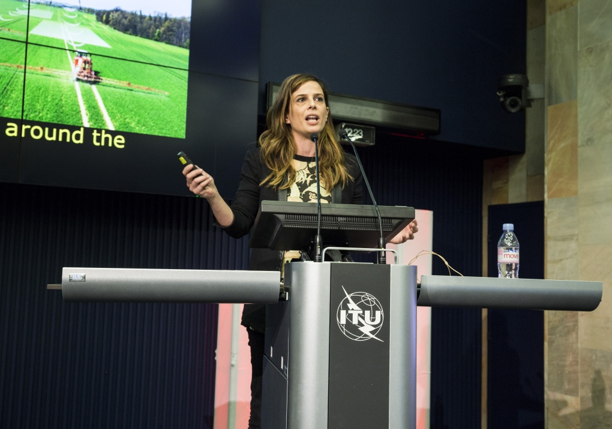

<aside class="translation-attribution">
この記事は、Free Software Foundation Europe による
<a href="https://download.fsfe.org/campaigns/pmpc/PMPC-Modernising-with-Free-Software.pdf">Public Money Public Code</a>
を ChatGPT が翻訳したものに多少手を加えたものです。元の記事は
<a href="https://creativecommons.org/licenses/by-sa/4.0/">CC BY‐SA 4.0 ライセンス</a>
のもとで提供されています。翻訳版も同じく CC BY‐SA 4.0 ライセンスのもとで提供されます。
</aside>

自由ソフトウェアは、バルセロナのスマートシティおよびデジタル化戦略の中核を担う要素となっています。本インタビューでは、バルセロナ市議会の最高技術・デジタルイノベーション責任者（CTIO）である Francesca Bria が、自由ソフトウェアがどのようにイノベーションを支えているのかを語ります。

**お仕事の中で、デジタル主権や倫理的なデジタル基準についてよく言及されています。デジタル主権とは何か、また自由ソフトウェアがそこにどのように関わるのか、簡単に説明していただけますか？**

私は、バルセロナ市のデジタルおよびテクノロジー戦略、とりわけスマートシティ戦略を再構築するため、CTIO に任命されました。私の使命は、データとテクノロジーを民主化し、それらのガバナンスを市民のために機能する形へと見直すことです。

**Decidim のようなプラットフォームが自由ソフトウェアであるかどうかは、重要なのでしょうか？**

<aside class="context-aside">
Decidim は、市民が議論し、会議に参加し、都市での暮らしをより良くするための提案を作成できる、参加型民主主義のためのソフトウェア・フレームワークです。このプラットフォームのソースコードは公開されており、他の都市もそれを利用し、それぞれの要件に合わせて改変することができます。Decidim は、マドリード市議会が開発した Consul という同様の自由ソフトウェア・プロジェクトを基盤としています。
</aside>

自由ソフトウェアであることは、決定的に重要です。まず、行政は公費を投じているのですから、市民がそのソフトウェアを管理でき、プラットフォームは公共のものとして維持されるべきです。Decidim Barcelona は市最大級の自由ソフトウェア・プロジェクトの一つであり、私たちはそこから多くのことを学んでいます。コミュニティによって管理・運営されるプラットフォームを行政の法制度のもとで実現できるようにするため、調達基準さえ変更する必要がありました。

私たちにとって、プライバシーへの配慮、データ主権、分散型技術、そして自由ソフトウェアは、都市のデジタルインフラを構成する重要な要素です。DECODE という別の自由ソフトウェア・プロジェクトを活用し、市民が自分のデータを自ら管理できるモジュールを Decidim に追加しています。データの安全性と匿名性を確保するとともに、どのデータを非公開にしておくのか、どのデータをどのような条件で市に提供するのかを、市民自身が決められるようにしています。

**この点で、自由ソフトウェアの最大の利点は何でしょうか？**

最大の可能性は、コードを閲覧・検証し、そこから学び、再利用できることにあります。これは非常に重要です。ライセンス料ではなく、人材や能力の育成に投資を集中させることで、コストを最小限に抑えることができるからです。

もう一つの重要な理由は、技術主権です。つまり、ベンダーロックインや大企業への依存から脱し、提供事業者を変更できるようにし、利用者の権利と自由を尊重する地域の事業者と協働し、私たち自身のデータに対する管理権を維持することです。プロプライエタリ・ソフトウェアでは、あらゆるものが外部の事業者や特定技術に精通した専門家へ委託されていました。私たちは、こうした内部の知識をこれ以上失い続けたくありません。

自由ソフトウェアによって、私たちはコミュニティと協働し、自由ソフトウェア開発者の才能を生かし、他都市と共同プロジェクトに取り組むことができます。長期的には、より自律的に、より独立して、そしてより透明になることができます。さらに、ソースコードを公開することは、納税者が負担した資金を社会へ還元する一つの方法でもあります。

出典：AI for Good Global Summit 2018. CC BY 2.0 ITU Pictures.

<aside class="context-aside">

Francesca Bria

Imperial College London でイノベーション経済学の博士号を、University of London の Birkbeck でデジタル経済学の修士号を取得。欧州委員会において、未来のインターネットおよびイノベーション政策に関する上級研究員・アドバイザーを務めています。

</aside>

そして最後に、これは倫理的・政治的な決断でもあります。バルセロナには、独自のデータ主権ガイドとデジタル倫理基準があります。これらの規則では、私たちが利用するデジタル情報とインフラは公共財であり、市民によって所有されるべきだと定めています。

**5年後、状況はどのようになっていると思いますか？**

バルセロナでは、ソフトウェア・アプリケーションやツールを継続的に開発しています。ゼロから開発を始める場合には、自由かつオープンソースのソフトウェアを優先して採用しています。また、バルセロナのデジタル変革計画では、年間予算の70％を自由かつオープンソースのソフトウェア開発に投資する方針を掲げています。

現在、ワークステーションを完全に自由なオペレーティングシステムへ移行するパイロットプロジェクトを含め、段階的な移行計画を進めています。しかし、これはワークステーションだけの話ではありません。情報インフラ全体を、オープン標準、オープンな技術スタック、そして相互運用性を重視する方向へ移行しています。また、このような意思決定が一人の人物や、一つの政権の政治的立場に左右されないことも重要です。このような大規模な移行を実現する正しい方法は、職員が主体的に取り組める環境を整え、研修に投資し、組織内に知識共有の仕組みを構築することだと考えています。

Sentilo はコンソーシアムによって運営されており、ドバイ、米国、イタリア、その他のヨーロッパ各地でも再利用されています。Decidim は現在、多くの都市で利用されており、私たちはさらに普及させたいと考えています。また、デジタルIDなどのソフトウェア・プロジェクトもあり、カタルーニャ地方の小規模自治体と地域内で共有しています。

さらに、他の都市がどのようなプロジェクトを開発し、自由ソフトウェアとして公開しているのかを把握するため、インタビューや調査も行っています。たとえば、ヘルシンキは交通手段のシェアリングに関する非常に優れたアプリを開発しており、私たちのものと似た市民向けアプリも提供しています。私たちはアムステルダムやトリノとも協力しており、さまざまな協働が進んでいます。自由ソフトウェアがなければ、これは実現できません。

<aside class="context-aside">
Sentilo は、現地から受信する大量の情報を処理する自治体や組織を対象とした、センサーおよびアクチュエーターのプラットフォームです。騒音、大気汚染、交通渋滞などを測定するセンサーをはじめ、さまざまな機器が生成する情報を処理します。活発で多様な都市や企業のコミュニティによって利用・支援されています。
</aside>

**新規開発予算の70％を自由ソフトウェアの開発に投資しているとのことですが、それは地域経済にどのような効果をもたらしていますか？**

地域の自由ソフトウェアを生み出し、協働型のイノベーション経済を強化できるオープンなテクノロジー・エコシステムを形成します。公共調達には、新たな市場を創出し、地域産業の力を引き出すことができます。

現在、公共調達を通じて私たちと協働している企業は3,000社あり、その60％以上が中小企業です。これらの契約には、ベンダーロックインや技術的な前提条件がないという利点があるため、必要な能力を備えていれば、どの企業でも契約を獲得することができます。これは都市行政にとって大きな変化です。私たちは、地域の自由・オープンソースソフトウェアの活動を後押しし、その活動を維持・発展させるための基盤を提供したいと考えています。

**自由ソフトウェアの利点を認識している都市がすでにある一方で、依然として懸念を抱いている行政機関もあります。そうした人々をどのように説得しますか？ 最も重要な論点は何でしょうか？**

第一に、投資した資金が地域の企業、産業、起業家からなるエコシステムに還元されること。第二に、他の都市と共同プロジェクトで協働でき、小規模な都市もその成果を活用できること。第三に、重要なインフラやサービスに対する技術主権を維持できることです。これらは、より民主的で、包摂的かつ持続可能なデジタル社会を築くうえで非常に重要です。

Erik Albers によるインタビュー。Alexandra Busch 編集。
